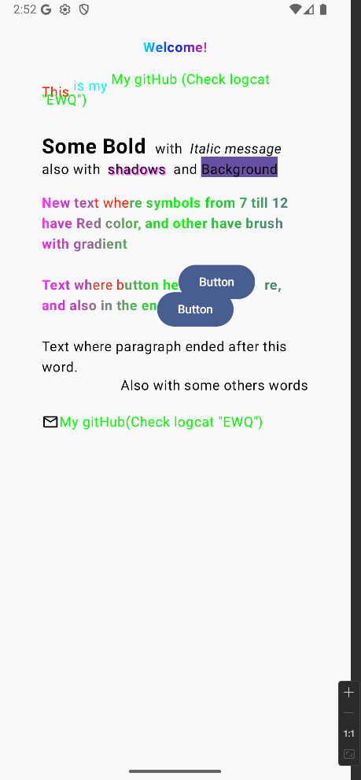

#StyledTExt

[](http://www.apache.org/licenses/LICENSE-2.0)
[](mailto:artofpaganini@gmail.com)

---

This library provides a convenient way to build complex, styled `AnnotatedString` instances in Android using Kotlin DSL builders.  
It introduces several entities — `StyledTextContainer`, `StyledTextBuilder`, `StyledLinkBuilder`, `SpanStyleBuilder`, and `ParagraphStyleBuilder` — which wrap `AnnotatedString` and allow you to easily apply styles and links to text fragments, similar in concept to `SpannableBuilder`.

The main goal is to simplify text styling inside mappers or ViewModels and pass a fully styled `AnnotatedString` to the UI.

## 📦 Installation

Add the dependency to your `build.gradle`:

```kotlin
// https://mvnrepository.com/artifact/io.github.artofpaganini/styled_text
implementation("io.github.artofpaganini:styled_text:1.0.1")
```

## 📚 Main Entities

Here are some key concepts of the library, more details can be found in the documentation.

| Class / Inline Function                                       | Purpose                                                                          |
|---------------------------------------------------------------|----------------------------------------------------------------------------------|
| StyledTextContainer / styledTextContainer                     | A container that collects and combines styled text/link fragments.               |
| StyledTextBuilder / styledText                                | Builder for a single text fragment with support for SpanStyle and ParagraphStyle. |
| StyledLinkBuilder / styledLink                                | Builder for a single clickable link fragment (LinkAnnotation.Clickable).         |
| SpanStyleBuilder / decorStyle or outerDecorStyle              | Builder for creating SpanStyle to decorate a text/link fragment.                 |
| ParagraphStyleBuilder / paragraphStyle or outerParagraphStyle | Builder for creating ParagraphStyle (alignment, indents, line height, etc.)  |

---

### 🛠 Usage Examples

1. StyledTextContainer
```kotlin
val myString: AnnotatedString = styledTextContainer {
  styledText {
    text = "Text will change only from 7 to 12 characters according to captionBoldM"
    startIndex = 7
    endIndex = 12
    textStyle = Typography.captionBoldM
  }
  styledText {
    text = "Text will change only from 7 to 12 characters"
    startIndex = 7
    endIndex = 12
    paragraphStyle = paragraphStyle {
      textAlign = TextAlign.End
      textIndent = TextIndent(firstLine = 8.sp, restLine = 30.sp)
      platformStyle = PlatformParagraphStyle(includeFontPadding = false)
      lineHeightStyle = LineHeightStyle(
        alignment = LineHeightStyle.Alignment.Center,
        trim = LineHeightStyle.Trim.None
      )
    }
    decorStyle = spanStyle {
      color = SomeColors.pink
      fontSize = 40.sp
    }
  }
  styledText { text = " " }
  styledLink {
    anchor = "AndroidDev"
    link = "https://developer.android.com"
    decorStyle = spanStyle { color = SomeColors.green }
    focusedStyle = spanStyle {
      background = SomeColors.yellow
      textDecoration = Underline
    }
    hoveredStyle = spanStyle {
      color = SomeColors.blue
      textDecoration = Underline
    }
    pressedStyle = spanStyle {
      color = SomeColors.red
      textDecoration = TextDecoration.LineThrough
    }
  }
}

// If your string has clickable links, you need to handle them
Box(modifier = modifier) {
  Text(
    text = myString.withLink { link ->
      // Here you will get the URL of the clicked "clickable" text
    },
  )
}

```

2. StyledTextBuilder
```kotlin
val myString1: AnnotatedString =  styledText {
  text = "The text will change only from the 7th to the 12th character, according to captionBoldM"
  startIndex = 7
  endIndex = 12
  textStyle = Typography.captionBoldM
}

val myString2: AnnotatedString = styledText {
  text = "The text will change only from the 7th to the 12th character"
  startIndex = 7
  endIndex = 12
  paragraphStyle = paragraphStyle {
    textAlign = TextAlign.End
    textIndent = TextIndent(firstLine = 8.sp, restLine = 30.sp)
    platformStyle = PlatformParagraphStyle(includeFontPadding = false)
    lineHeightStyle = LineHeightStyle(
      alignment = LineHeightStyle.Alignment.Center,
      trim = LineHeightStyle.Trim.None
    )
  }
  decorStyle = spanStyle {
    color = SomeColors.pink
    fontSize = 40.sp
  }
  outerDecorStyle = spanStyle {
    color = SomeColors.pink
    fontSize = 40.sp
  }
}

val myString3: AnnotatedString = styledText {
  text = "Characters from 7 to 12 will be pink, and all characters before 7 and after 12 will be yellow"
  startIndex = 7
  endIndex = 12
  paragraphStyle = paragraphStyle {
    textAlign = TextAlign.End
  }
  decorStyle = spanStyle {
    color = SomeColors.pink
    fontSize = 30.sp
  }
  outerDecorStyle = spanStyle {
    color = SomeColors.yellow
    fontSize = 40.sp
  }
}

// All text characters are pink and after the 5th character in the text, some inlineContent is displayed, in our case, an icon
val inlineId = "imageId"
val inlineContent = mapOf(
  inlineId to InlineTextContent(
    Placeholder(20.sp, 20.sp, PlaceholderVerticalAlign.TextCenter)
  ) {
    Image(
      imageVector = Icons.Default.SomeIcon,
      modifier = Modifier.size(42.dp),
      contentDescription = ""
    )
  }
)
val myString4: AnnotatedString = styledText {
  text = "All text characters are pink and after the 5th character in the text, some inlineContent is displayed, in our case, an icon"
  inlineContentId = inlineId
  inlineContentIndex = 5
  decorStyle = spanStyle {
    color = SomeColors.pink
    fontSize = 30.sp
  }
}
```

3. StyledLinkBuilder
```kotlin
val myLink1: AnnotatedString = styledLink {
  anchor = "Google"   // The default word is "link"
  link = "https://google.com"
  decorStyle = spanStyle {
    color = Color.Blue
  }
  hoveredStyle = spanStyle {
    color = Color.Green
  }
}

val myLink2: AnnotatedString = styledLink {
  anchor = "AndroidDev"
  link = "https://developer.android.com"
  decorStyle = spanStyle {
    color = SomeColors.green
  }
  focusedStyle = spanStyle {
    background = SomeColors.yellow
    textDecoration = Underline
  }
  hoveredStyle = spanStyle {
    color = SomeColors.blue
    textDecoration = Underline
  }
  pressedStyle = spanStyle {
    color = SomeColors.red
    textDecoration = TextDecoration.LineThrough
  }
}

Box(modifier = modifier) {
  Text(
    text = text.withLink { link ->
      // Here you will get your URL for subsequent processing
    },
  )
}
```


The capabilities of the SpanStyleBuilder / ParagraphStyleBuilder entities are described within them.

4. SpanStyleBuilder / ParagraphStyleBuilder

```kotlin
val myDecorStyle: SpanStyle = spanStyle {
  color = Color.Magenta
  fontSize = 18.sp
  fontWeight = FontWeight.Bold
}

val myParagraphStyle: ParagraphStyle = paragraphStyle {
  textAlign = TextAlign.End
  lineHeight = 20.sp
  platformStyle = PlatformParagraphStyle(includeFontPadding = false)
  lineHeightStyle = LineHeightStyle(
    alignment = LineHeightStyle.Alignment.Center,
    trim = LineHeightStyle.Trim.None
  )
}
```

---

## 🎯 What You Get

 - Build complex styled `AnnotatedString` objects with minimal boilerplate.
 - Apply multiple styles (`SpanStyle`, `ParagraphStyle`) to specific text ranges.
 - Create clickable links with different visual states (default, hovered, focused, pressed).
 - Combine multiple styled fragments into a single `AnnotatedString`.
 - Insert inline content (e.g., icons) directly into text.
 - Keep styling logic separate from UI rendering.



And more and more....

---

### 📖 What This Library Does
This library allows developers to:

 - Build complex AnnotatedString objects using a clean, type-safe Kotlin DSL.
 - Apply multiple styles (SpanStyle, ParagraphStyle) to specific text ranges.
 - Easily create clickable links with different visual states (default, hovered, focused, pressed).
 - Combine multiple styled fragments into a single AnnotatedString.
 - Manage inline content (e.g., icons, buttons...) inside text.
 - Keep text styling logic separate from UI rendering.

---

###  📬 Contact
Email: [](mailto:artofpaganini@gmail.com)

---

###  📄 License

This project is licensed under the  